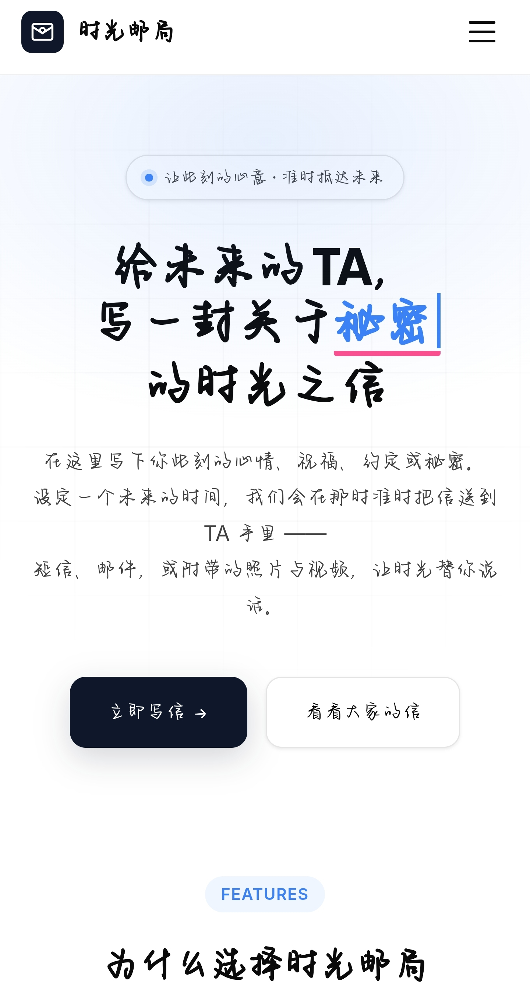
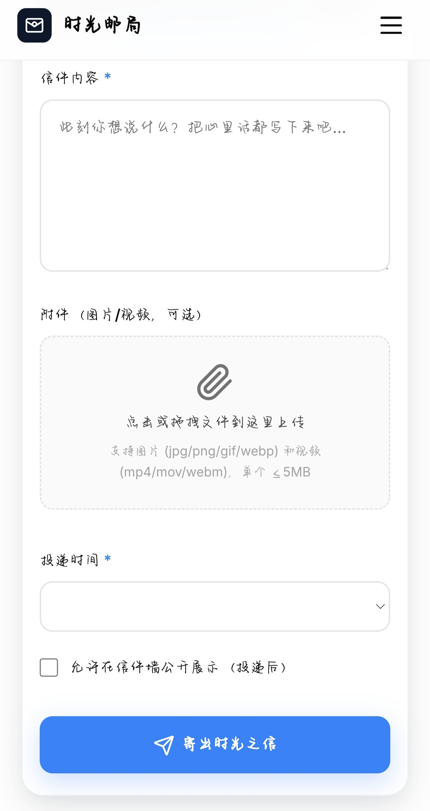
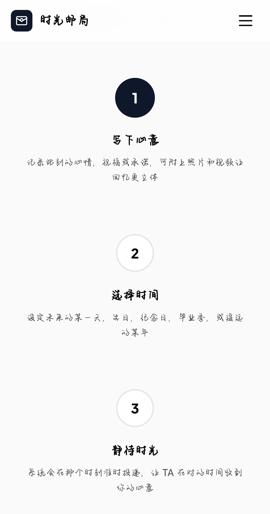

# 时光邮局

写信给未来，让时光替你说话。

<table>
  <tr>
    <td width="33%"></td>
    <td width="33%"></td>
    <td width="33%"></td>
  </tr>
</table>

## 功能

- 设定未来时间，通过短信/邮件定时投递
- 上传图片（≤20MB）和视频（≤1GB）作为附件
- 彩虹聚合登录（微信/QQ/支付宝/钉钉等）
- 收件人 H5 查看页，支持回复对话
- 密保问题保护私密信件
- 内置 10 种场景模板，一键填入
- 公开信件广场，分享你的时光故事
- admin 后台管理面板

## 技术栈

PHP 8.0+ · SQLite · 零框架 · Nginx

2C2G VPS 即可运行，无需 MySQL、Redis、Docker。

## 快速开始

```bash
# 1. 克隆仓库
git clone https://github.com/yourname/timepost.git
cd timepost

# 2. 配置环境
cp .env.example .env
vim .env

# 3. 初始化数据库
php storage/init_db.php

# 4. 启动 PHP 开发服务器（测试用）
php -S localhost:8080 -t public/
```

## 生产部署

详见 [DEPLOY.md](DEPLOY.md)

## 配置说明

| 配置项 | 说明 |
|--------|------|
| `STORAGE_LOCAL_PATH` | 附件存储目录绝对路径，需可写 |
| `CAIHONG_*` | 彩虹聚合登录（可选，留空则仅支持手机号注册） |
| `SMS_*` | 阿里云短信配置（可选） |
| `MAIL_*` | SMTP 邮件配置（可选） |
| `ALERT_EMAIL` | 发送失败告警邮箱（可选） |

> 短信和邮件至少配置一个，否则无法投递信件。

## 定时任务

```bash
# 每分钟扫描待发送信件
* * * * * cd /var/www/timepost && php cron/send.php >> storage/logs/send.log 2>&1

# 每天 3 点备份数据库
0 3 * * * cd /var/www/timepost && php cron/backup_db.php >> storage/logs/backup.log 2>&1
```

## 项目结构

```
timepost/
├── public/              # Web 根目录
├── app/
│   ├── Controllers/     # 控制器
│   ├── Libraries/       # 工具类
│   └── Views/           # 视图模板
├── config/              # 配置文件
├── cron/                # 定时脚本
├── storage/             # 数据库和日志
└── .env.example         # 环境变量模板
```

## License

MIT
