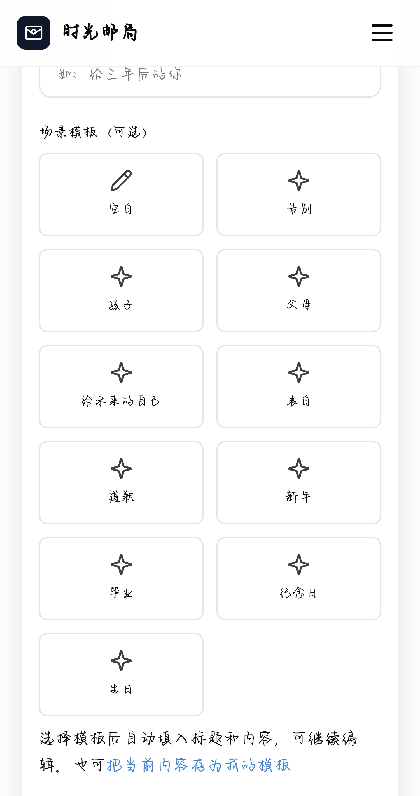

<p align="center">
  <a href="https://github.com/xilingyiyu/timepost">
    
  </a>
</p>

<h1 align="center">时光邮局 · TimePost</h1>

<p align="center">
  <a href="https://github.com/xilingyiyu/timepost/blob/master/LICENSE"></a>
  <a href="https://github.com/xilingyiyu/timepost/releases"></a>
  <a href="https://github.com/xilingyiyu/timepost/stargazers"></a>
  
  
</p>

<p align="center">
  <b>写信给未来，让时光替你说话。</b><br>
  设定未来时间，通过短信或邮件定时投递 —— 致一年后的自己、十年后的挚友、或某个特别日子里的 TA。
</p>

<p align="center">
  <a href="#功能亮点">功能亮点</a> ·
  <a href="#截图">截图</a> ·
  <a href="#快速开始">快速开始</a> ·
  <a href="#生产部署">生产部署</a> ·
  <a href="#配置说明">配置说明</a> ·
  <a href="#联系我们">联系我们</a>
</p>

---

## 功能亮点

| | 特性 | 说明 |
|---|------|------|
| **定时投递** | 短信 / 邮件 | 设定未来日期，系统自动发送，可附图片和视频 |
| **第三方登录** | 微信 / QQ / 支付宝 / 钉钉 等 | 彩虹聚合登录，一键注册，降低使用门槛 |
| **密保保护** | 私密信件 | 设置安全问题，确保只有你和收件人能查看 |
| **回复对话** | H5 回复 | 收件人可回复，形成跨越时间的对话 |
| **内置模板** | 10 种场景 | 致自己 / 致挚友 / 致恋人 / 生日祝福 / 道歉信 等，一键填入 |
| **公开广场** | 故事分享 | 允许公开的信件展示在广场，分享你的时光故事 |
| **附件上传** | 图片 + 视频 | 图片 ≤20MB，视频 ≤1GB，单封信最多 9 个附件 |
| **管理后台** | 全功能面板 | 信件审核、用户管理、系统配置，运营无忧 |

## 截图

<table>
  <tr>
    <td width="50%"></td>
    <td width="50%"></td>
  </tr>
  <tr>
    <td width="50%" align="center"><b>首页</b></td>
    <td width="50%" align="center"><b>写信界面</b></td>
  </tr>
  <tr>
    <td width="50%"></td>
    <td width="50%"></td>
  </tr>
  <tr>
    <td width="50%" align="center"><b>三步发送流程</b></td>
    <td width="50%" align="center"><b>10 种内置模板</b></td>
  </tr>
</table>

## 技术栈

| 组件 | 技术选型 | 说明 |
|------|---------|------|
| 后端语言 | PHP 8.0+ | 零框架，纯原生，高性能 |
| 数据库 | SQLite 3.x | 零运维，不用 MySQL/Redis，2C2G 服务器承载日活 500 |
| Web 服务器 | Nginx / Apache | 推荐 Nginx |
| 前端 | 原生 HTML + CSS + JS | 无前端框架依赖，轻量快速 |
| 身份认证 | JWT | 无 Session，适合 API 架构 |
| 第三方服务 | 彩虹聚合登录 / 阿里云短信 / SMTP | 模块化，按需启用 |

## 快速开始

### 环境要求

- PHP 8.0+（需启用 `curl`、`pdo_sqlite`、`mbstring`、`openssl`、`fileinfo`）
- SQLite 3.x（PHP 自带，无需单独安装）
- Nginx 或 Apache
- 无需 MySQL、Redis、Node.js、Composer、Docker

### 开发环境

```bash
# 1. 克隆仓库
git clone https://github.com/xilingyiyu/timepost.git
cd timepost

# 2. 配置环境变量
cp .env.example .env
# 编辑 .env，至少设置 APP_URL 和 JWT_SECRET

# 3. 初始化数据库
php storage/init_db.php
# 输出: 数据库初始化完成
# 默认管理员: admin / admin123（请尽快修改）

# 4. 启动开发服务器
php -S localhost:8080 -t public/

# 5. 浏览器打开 http://localhost:8080
```

### 验证

- 打开首页，看到"时光邮局"着陆页
- 注册/登录，写一封测试信
- 手动执行发送脚本验证投递：`php cron/send.php`

---

## 生产部署

### 1. 服务器环境初始化

#### Ubuntu 20.04 / 22.04

```bash
apt update
apt install -y nginx php8.1-fpm php8.1-sqlite3 php8.1-curl php8.1-mbstring php8.1-fileinfo
```

#### CentOS 7 / OpenCloudOS 9

```bash
yum install -y nginx php83 php83-php-fpm php83-php-pdo php83-php-mbstring
```

#### 宝塔面板（可选，方便可视化管理）

```bash
curl -sSO https://download.bt.cn/install/install_panel.sh && bash install_panel.sh
```

### 2. 上传代码

将整个 `timepost` 目录上传到服务器，推荐路径 `/var/www/timepost`。

### 3. 初始化数据库

```bash
cd /var/www/timepost
php storage/init_db.php
```

### 4. 复制并配置 .env

```bash
cp .env.example .env
vim .env
```

必须填写：
- `APP_URL` — 站点完整 URL
- `JWT_SECRET` — 运行 `php -r 'echo bin2hex(random_bytes(32));'` 生成
- `STORAGE_LOCAL_PATH` — 附件存储目录

### 5. 设置目录权限

```bash
# 应用和 storage 目录需要 www 用户权限
chown -R www:www /var/www/timepost
chmod -R 755 /var/www/timepost

# storage 需要可写
chmod -R 775 /var/www/timepost/storage

# .env 文件保护（只 root 和 www 组可读）
chown root:www /var/www/timepost/.env
chmod 640 /var/www/timepost/.env
```

### 6. 配置文件存储

```bash
# 创建本地上传目录
mkdir -p /var/www/timepost/storage/uploads
chown www:www /var/www/timepost/storage/uploads

# 也可使用外部挂载（如 sshfs / NFS），在 .env 中设置:
# STORAGE_LOCAL_PATH=/mnt/timepost-storage
```

### 7. 配置 Nginx

创建 Nginx 站点配置文件：

```nginx
server {
    listen 80;
    server_name timepost.yourdomain.com;
    root /var/www/timepost/public;
    index index.php;

    client_max_body_size 1024m;

    # 禁止访问敏感目录
    location ~ ^/(app|config|storage|cron|\.) {
        deny all;
        return 404;
    }

    # 路由转发（单入口模式）
    location / {
        try_files $uri $uri/ /index.php?$query_string;
    }

    # PHP 处理
    location ~ \.php$ {
        fastcgi_pass unix:/run/php/php8.1-fpm.sock;
        fastcgi_index index.php;
        fastcgi_param SCRIPT_FILENAME $document_root$fastcgi_script_name;
        include fastcgi_params;
    }

    # 静态资源缓存
    location ~* \.(js|css|png|jpg|jpeg|gif|ico|svg|woff2)$ {
        expires 30d;
        add_header Cache-Control "public, immutable";
    }
}
```

重新加载 Nginx：

```bash
nginx -t && systemctl reload nginx
```

### 8. 配置 HTTPS（推荐）

使用 Certbot 获取免费 SSL 证书：

```bash
# Ubuntu
snap install certbot --classic
certbot --nginx -d timepost.yourdomain.com

# 验证自动续期
certbot renew --dry-run
```

### 9. 配置定时任务

```bash
crontab -e
```

添加以下两行：

```
* * * * * cd /var/www/timepost && php cron/send.php >> storage/logs/send.log 2>&1
0 3 * * * cd /var/www/timepost && php cron/backup_db.php >> storage/logs/backup.log 2>&1
```

第一行每分钟扫描待发送信件，第二行每天凌晨 3 点备份数据库。

## 配置说明

### 应用配置

| 变量 | 必填 | 说明 | 示例 |
|------|------|------|------|
| `APP_NAME` | 否 | 站点名称，默认"时光邮局" | 时光邮局 |
| `APP_URL` | **是** | 站点完整 URL | `https://timepost.yourdomain.com` |
| `APP_DEBUG` | 否 | 调试模式，生产环境关闭 | `false` |

### JWT 配置

| 变量 | 必填 | 说明 | 示例 |
|------|------|------|------|
| `JWT_SECRET` | **是** | 签名密钥，需 32 字节随机 hex | `php -r 'echo bin2hex(random_bytes(32));'` |
| `JWT_TTL` | 否 | Token 有效期（秒），默认 604800（7 天） | `604800` |

### 附件存储

| 变量 | 必填 | 说明 | 示例 |
|------|------|------|------|
| `STORAGE_LOCAL_PATH` | **是** | 附件上传目录绝对路径 | `/var/www/timepost/storage/uploads` |
| `ATTACHMENT_MAX_COUNT` | 否 | 单封信最大附件数，默认 9 | `9` |
| `ATTACHMENT_ALLOW_EXT` | 否 | 允许的扩展名 | `jpg,jpeg,png,gif,webp,mp4,mov,avi,webm` |

附件限制：图片 ≤20MB，视频 ≤1GB（后端自动判断）。

### 第三方登录（彩虹聚合登录）

1. 前往 [https://u.arsn.cn](https://u.arsn.cn) 注册并创建应用
2. 获取 AppID 和 AppKey
3. 填写回调地址

```env
CAIHONG_API_BASE=https://u.arsn.cn/connect.php
CAIHONG_APPID=你的AppID
CAIHONG_APPKEY=你的AppKey
CAIHONG_REDIRECT_URI=https://你的域名/api/auth/oauth/callback
```

留空则不启用 OAuth，仅支持手机号注册。

### 短信配置（阿里云）

```env
SMS_PROVIDER=aliyun
SMS_ACCESS_KEY=你的AccessKey
SMS_SECRET_KEY=你的SecretKey
SMS_SIGN=时光邮局
SMS_TEMPLATE_CODE=SMS_123456789
```

### 邮件配置（SMTP）

以 QQ 邮箱为例：

```env
MAIL_HOST=smtp.qq.com
MAIL_PORT=465
MAIL_USERNAME=你的邮箱@qq.com
MAIL_PASSWORD=你的SMTP授权码
MAIL_FROM=你的邮箱@qq.com
MAIL_FROM_NAME=时光邮局
```

QQ 邮箱需在设置中开启 SMTP 服务并获取授权码。

### 运维告警

```env
ALERT_EMAIL=admin@yourdomain.com
BACKUP_RETENTION_DAYS=30
```

`ALERT_EMAIL` 设置发送失败告警接收邮箱（留空不告警）；`BACKUP_RETENTION_DAYS` 设置备份保留天数。

> **注意：** 短信和邮件至少配置一个，否则无法投递信件。

## 常见问题

### 上传附件失败

1. 确认 PHP 已启用 `fileinfo` 扩展
2. 确认 `STORAGE_LOCAL_PATH` 路径存在且 `www` 用户有写权限
3. 确认 Nginx `client_max_body_size` 配置为 `1024m`
4. 确认 PHP `upload_max_filesize` 和 `post_max_size` 足够大

```ini
; php.ini
upload_max_filesize = 1024M
post_max_size = 1024M
```

### 短信/邮件发送失败

1. 确认发送脚本正常运行：`php cron/send.php`
2. 查看发送日志：`tail -f storage/logs/send.log`
3. 检查阿里云短信余额和模板审核状态
4. 检查 SMTP 账号密码是否正确

### 页面显示 403 / 404

1. 确认 Nginx 配置的 `root` 指向 `public/` 目录
2. 确认文件权限正确：`chown -R www:www /var/www/timepost`
3. 检查 `.env` 文件权限为 640

### OAuth 登录回调失败

1. 确认 `.env` 中 `CAIHONG_REDIRECT_URI` 与彩虹聚合后台配置一致
2. 确认域名已正确解析并配置了 HTTPS
3. 检查回调地址末尾路径：`/api/auth/oauth/callback`

### 数据库损坏

SQLite 一般不会损坏，若遇到问题可恢复最近备份：

```bash
ls -lt storage/backups/
cp storage/backups/timepost_YYYYMMDD_HHMMSS.db storage/timepost.db
```

## 安全检查清单

- [ ] 默认管理员密码已修改（默认 admin / admin123）
- [ ] `.env` 文件权限为 640，非公开可读
- [ ] Nginx 已配置禁止访问 `.env`、`storage/`、`app/` 目录
- [ ] `JWT_SECRET` 已替换为随机字符串
- [ ] HTTPS 已启用
- [ ] 目录权限：`public/uploads` 不对外暴露目录索引

## 项目结构

```
timepost/
├── public/                      # Web 根目录（Nginx 指向这里）
│   ├── index.php                # 入口文件
│   └── assets/                  # 静态资源（CSS/JS/图片）
│       ├── css/
│       │   ├── app.css          # 前台样式
│       │   └── admin.css        # 后台样式
│       └── js/
│           └── app.js           # 前台脚本
├── app/
│   ├── Controllers/             # 控制器
│   │   ├── BaseController.php   # 基类
│   │   ├── Home.php             # 前台页面
│   │   ├── Admin.php            # 后台页面
│   │   ├── AdminApi.php         # 后台 API
│   │   └── Api/                 # 前台 API
│   │       ├── Auth.php         # 认证注册
│   │       ├── OauthLogin.php   # 第三方登录
│   │       ├── Attachment.php   # 附件上传
│   │       └── Letter.php       # 信件管理
│   ├── Libraries/               # 工具类
│   │   ├── Database.php         # SQLite 数据库封装
│   │   ├── JwtHelper.php        # JWT 令牌
│   │   ├── CaihongOauth.php     # 彩虹聚合登录 SDK
│   │   ├── SmsSender.php        # 短信发送
│   │   ├── MailSender.php       # 邮件发送
│   │   └── RateLimiter.php      # 频率限制
│   └── Views/                   # 视图模板
│       ├── home.php             # 首页
│       ├── write.php            # 写信
│       ├── login.php            # 登录
│       ├── view_letter.php      # 看信
│       └── admin/               # 后台视图
├── config/
│   ├── config.php               # 全局配置 + .env 加载
│   └── routes.php               # 路由表
├── cron/
│   ├── send.php                 # 定时发送脚本
│   └── backup_db.php            # 数据库备份脚本
├── storage/
│   ├── init_db.php              # 数据库初始化
│   ├── timepost.db              # SQLite 数据库（自动生成）
│   └── logs/                    # 日志目录
└── .env.example                 # 环境变量模板
```

## 性能参考

| 指标 | 数值 |
|------|------|
| 建议服务器配置 | 2C2G |
| 承载日活用户 | 500 |
| 并发请求 | 50 QPS |
| 单封附件上限 | 9 个文件 |
| 图片大小上限 | 20MB |
| 视频大小上限 | 1GB |
| 定时扫描频率 | 每分钟 1 次 |
| 万封信用量 | ~10MB |

## 联系我们

如果你觉得这个项目有帮助，欢迎 Star 支持。

| 方式 | 联系方式 |
|------|---------|
| 邮箱 | xilingyiyu@gmail.com |
| 微信 | xilingyiyu |
| GitHub Issues | [https://github.com/xilingyiyu/timepost/issues](https://github.com/xilingyiyu/timepost/issues) |

有任何问题、建议或合作意向，欢迎通过以上方式联系。

## License

[](https://github.com/xilingyiyu/timepost/blob/master/LICENSE)

MIT © 2025 [xilingyiyu](https://github.com/xilingyiyu)
